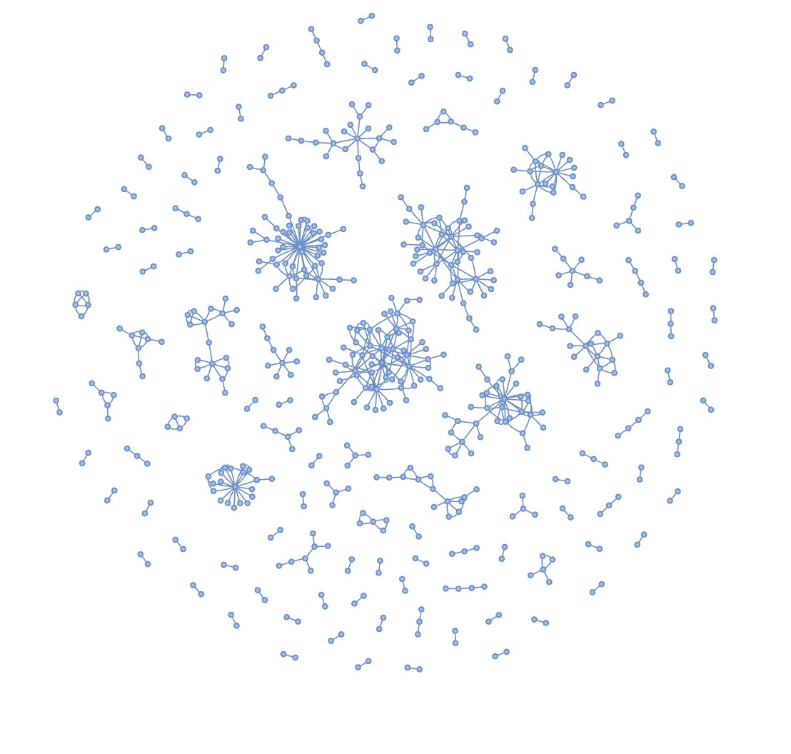
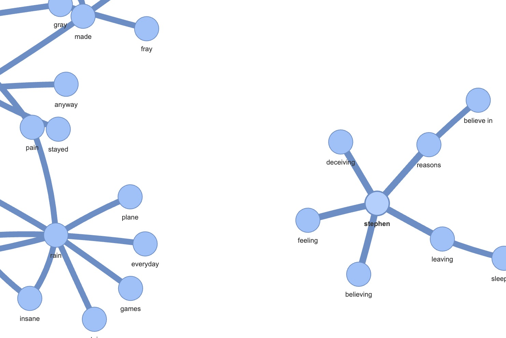

# Swift Rhymes

This is a repository that contains some words that Taylor Swift has rhymed in her songs.
These rhymes were manually identified (I had a bit too much free time this summer),
and then the python script `grapher.py` constructs a graph and displays this graph with `pyvis`.

`pyvis` creates a file called `output_graph.html`. This file can be viewed with a web browser.

Screenshots of the final result is shown here. Two nodes are connected if there is a song in which
Taylor has rhymed those words

